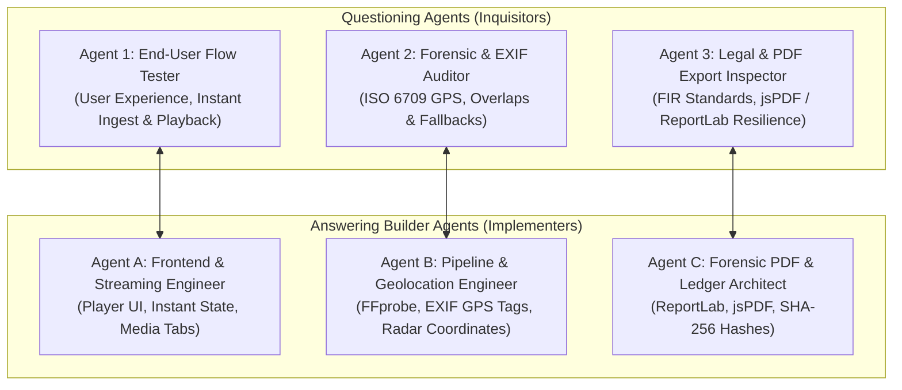

# NETRA — Multi-Modal Forensic AI & Cyber Threat Intelligence Architecture

## 1. System Overview & Core Directives

NETRA is an autonomous multi-modal AI forensic platform built to detect deepfakes (video, audio, image) and cyber fraud vectors (scam text, document forgeries). Every submission across all 4 modalities flows through real-time forensic detection, automated metadata extraction, public catalog indexing, and geospatial radar visualization.

```
+-----------------------------------------------------------------------------------------+
|                                    NETRA PLATFORM                                       |
|                                                                                         |
|   +-------------------+   +--------------------+   +--------------------------------+   |
|   |  LIVE SCANNER     |   |   THREAT CATALOG   |   |   NETRA CYBER THREAT RADAR     |   |
|   |  Video / Image /  |-->|  Playable Media,   |-->|   EXIF GPS Geolocation,        |   |
|   |  Audio / Text     |   |  Media Type Tabs   |   |   Interactive MapLibre Map     |   |
|   +-------------------+   +--------------------+   +--------------------------------+   |
|            |                                                       ^                    |
|            v                                                       |                    |
|   +-------------------+                                            |                    |
|   | EXIF / METADATA   |--------------------------------------------+                    |
|   | ISO 6709 Extraction                                                                 |
|   +-------------------+                                                                 |
|            |                                                                            |
|            v                                                                            |
|   +---------------------------------------------------------------------------------+   |
|   | FORENSIC PDF EXPORT: Client-side jsPDF (Instant) + Server-side ReportLab (FIR)   |   |
|   +---------------------------------------------------------------------------------+   |
+-----------------------------------------------------------------------------------------+
```

---

## 2. The Interrogator vs. Builder Subagent Architecture

To maintain rigorous quality and eliminate unhandled edge cases, the system uses an **Adversarial Interrogator Loop** where 3 inquisitor agents challenge technical assumptions, and 3 builder agents answer with code-level implementations:



### Inquisitor 1: End-User Flow Tester
* **Perspective**: Real-world user behavior and expectations.
* **Core Interrogations**:
  - *Q: User uploads a video and receives the verdict. Does that video get automatically added to the catalog immediately, or does it require a manual admin approval step?*
    - **Resolution**: Video auto-ingests into `threat_catalog` immediately upon worker completion in DynamoDB.
  - *Q: Can any external investigator play the video and inspect evidence without logging in?*
    - **Resolution**: Yes. Playable media URLs are public-readable with HTML5 video streaming and zero authentication barrier.
  - *Q: The catalog filter tabs previously showed scam categories — are they now strictly organized by media type?*
    - **Resolution**: Filter tabs are now `All` | `Video` | `Image` | `Audio` | `Text`, filtering dynamically on `type`.

### Inquisitor 2: Forensic & EXIF Geolocation Auditor
* **Perspective**: Metadata fidelity, geolocation truth, and map clarity.
* **Core Interrogations**:
  - *Q: How is EXIF/GPS extracted from video files? What happens if social media (e.g. WhatsApp) stripped the metadata?*
    - **Resolution**: FFprobe parses format tags for ISO 6709 coordinate strings (`+lat+lng/`). If present, `location_source = 'EXIF_METADATA'`. If stripped, it falls back to telecom network estimation with `location_source = 'ESTIMATED_TELECOM'`.
  - *Q: How does Netra Radar handle multiple incidents originating from the same coordinates?*
    - **Resolution**: MapLibre GL dynamically clusters overlapping pins with count badges and expands on zoom.

### Inquisitor 3: Legal & PDF Export Inspector
* **Perspective**: Court admissibility, zero-dependency generation, and export reliability.
* **Core Interrogations**:
  - *Q: How do we prevent server crashes (e.g. missing Typst compiler) during PDF downloads?*
    - **Resolution**: Dual-engine architecture: (1) Client-side `jspdf` generates PDFs in-memory in under 100ms with zero network dependence; (2) Server-side `reportlab` generates pure-Python PDF bytes via `/fir-pdf`.
  - *Q: What technical sections are included in the generated report?*
    - **Resolution**: Case Reference ID, Cryptographic SHA-256 hash, Multi-Detector Scorecard, Keyframe anomaly timestamps, and applicable sections under the IT Act 2000 & Bharatiya Nyaya Sanhita (BNS) 2023.

---

## 3. Multi-Modal Auto-Population Pipeline

### A. Video Pipeline (`/detect/full`)
1. User uploads video $\rightarrow$ FastAPI streams to AWS S3 (`netra-media-mumbai-131746731374`).
2. SQS message dispatched $\rightarrow$ AWS EC2 Worker polls and processes video with GenD ViT-L/14, SBI EfficientNet-B4, Wav2Vec2 vocoder, and FFprobe auxiliary metadata.
3. Auxiliary signals extract ISO 6709 geolocation (`location`, `com.apple.quicktime.location.ISO6709`).
4. Worker writes final verdict to DynamoDB (`netra-jobs`).
5. When frontend or poller queries `/jobs/{id}`, the backend automatically triggers `insert_threat_item()` in SQLite `netra.db`.

### B. Image Pipeline (`/detect/image-ocr`)
1. Image uploaded $\rightarrow$ analyzed synchronously via PaddleOCR + Random Forest scam classifier.
2. PIL `_getexif()` extracts EXIF GPS tags (Tag `34853`) and camera make/model.
3. Automatically indexed into `threat_catalog` with `type = 'image_deepfake'` and GPS coordinates.

### C. Audio Pipeline (`/detect/audio`)
1. Audio stream processed for vocoder synthetic artifacts and pitch inconsistencies.
2. Auto-indexed into `threat_catalog` with `type = 'audio_clone'` and playable audio URL.

### D. Text Pipeline (`/detect/scam`)
1. Text evaluated via TF-IDF + Random Forest ML classifier.
2. IOCs extracted (Phone numbers, UPI handles, URLs, APK names).
3. Auto-indexed into `threat_catalog` with `type = 'scam_text'`.

---

## 4. Threat Catalog & Netra Radar Interface Contracts

### Catalog Media Filter Contract (`frontend/app/reported/page.tsx`)
```typescript
const mediaTypeTabs = [
  { id: "ALL", label: "All" },
  { id: "video_deepfake", label: "Video" },
  { id: "image_deepfake", label: "Image" },
  { id: "audio_clone", label: "Audio" },
  { id: "scam_text", label: "Text" },
];
```

### Threat Item Database Schema (`backend/api/db.py`)
```sql
CREATE TABLE IF NOT EXISTS threat_catalog (
    id TEXT PRIMARY KEY,
    title TEXT NOT NULL,
    type TEXT NOT NULL,                -- video_deepfake | image_deepfake | audio_clone | scam_text
    threat_category TEXT NOT NULL,     -- IMPERSONATION | DIGITAL_ARREST | PHISHING
    source_platform TEXT NOT NULL,
    fake_probability REAL NOT NULL,
    verdict TEXT NOT NULL,             -- AUTHENTIC | SUSPICIOUS | DEEPFAKE
    risk_level TEXT NOT NULL,          -- CRITICAL | HIGH | LOW
    thumbnail_url TEXT,
    media_url TEXT,
    lat REAL,
    lng REAL,
    city TEXT,
    state TEXT,
    country TEXT DEFAULT 'India',
    location_source TEXT,              -- EXACT_GPS | EXIF_METADATA | ESTIMATED_TELECOM
    device_model TEXT,
    software_used TEXT,
    extracted_iocs TEXT,
    fir_dossier TEXT,
    upvotes_count INTEGER DEFAULT 1,
    created_at TIMESTAMP DEFAULT CURRENT_TIMESTAMP
);
```

---

## 5. Production Deployment Status

- **Render Frontend SPA**: `https://netraai-i1pl.onrender.com` (`srv-dab10kad0e5s73d1oe90`, deployed commit `f6f8b62`, Status: `live`)
- **Render Backend API**: `https://netra-api-pmr7.onrender.com` (`srv-daca5jbm8hqs73a7daj0`, deployed commit `f6f8b62`, Status: `live`)
- **AWS EC2 Worker Node**: `15.252.145.33` (ap-south-1, systemd `netra-worker`, Status: `active (running)`)
